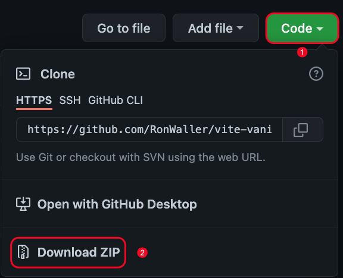

# Vite Vue Project Builder <!-- omit in toc -->

This repository will help create a boilerplate Vue project using Vite. When downloading the repo locally all future projects can be created just by copying and renaming folder your project name.

- [Dependencies](#dependencies)
- [Dev Dependencies](#dev-dependencies)
- [Tech Stack](#tech-stack)
- [How to Use](#how-to-use)
- [Installation](#installation)
  - [Open Terminial](#open-terminial)
  - [Build Project](#build-project)
  - [Open in Editor (VS Code)](#open-in-editor-vs-code)
- [License](#license)

## Dependencies


## Dev Dependencies


<br>

## Tech Stack

**Client:** Vue

## How to Use

- Use the 'src' folder for typical Vue project.
- Once new project has been setup and dependencies installed delete image folder and README
- Rename README_template to README for project

## Installation

<details>

<summary>Instructions</summary>



1. Download Zip File
   - Click Code Button (1)
   - Download Zip (2)
1. Unzip file
1. Move folder to project location
   - Rename folder to project name OR
   - Copy repo folder
   - Rename folder to project name

</br>

### Open Terminial

- Navigate to projects folder

Install dependencies

```bash
  npm install
```

Start the dev server

```bash
  npm run dev
```

### Build Project

To build for production

```bash
  npm run build
```

### Open in Editor (VS Code)

```bash
  code .
```

<br>

**Now you can delete Image folder and README**

</details>

## License

[](https://opensource.org/licenses/MIT)
